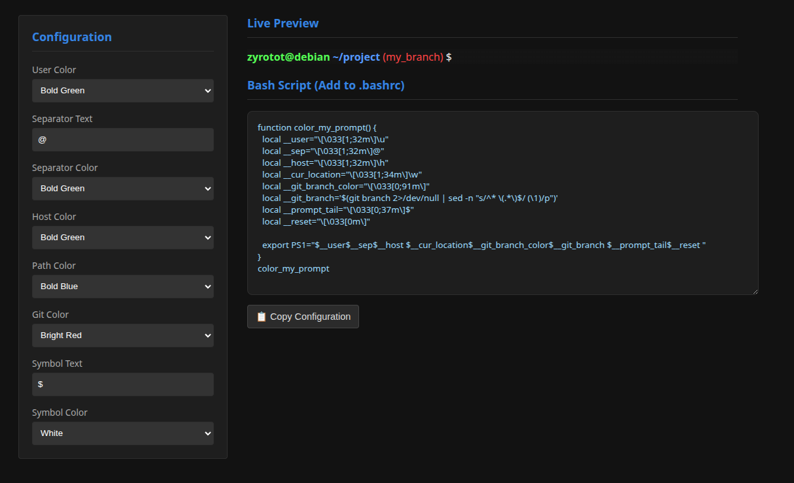

# Bash PS1 Designer

A small GUI tool to visually design a Bash `PS1` prompt with ANSI colors  
and instantly generate the corresponding shell code with git branch parsing.

The preview reflects bold vs non-bold and bright vs non-bright ANSI styles (badly).



---

## Requirements

- Python 3.10+
- Tkinter (usually included with Python on Linux)

On Debian / Ubuntu:
```bash
sudo apt install python3-tk
```

## Usage

Run with:
```bash
python3 main.py
```

Select the colors and symbols, copy the code and put then on your `.bashrc` file.
